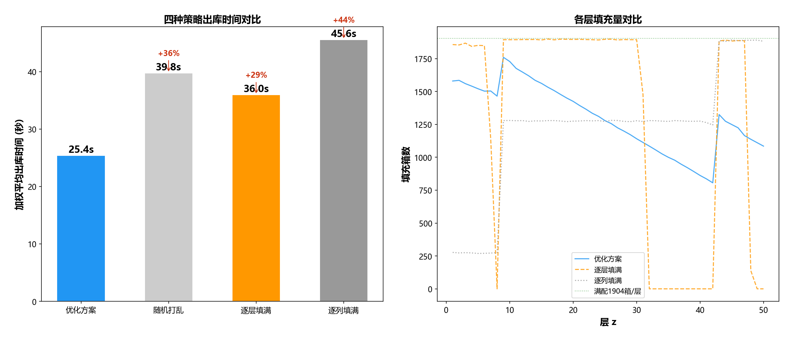
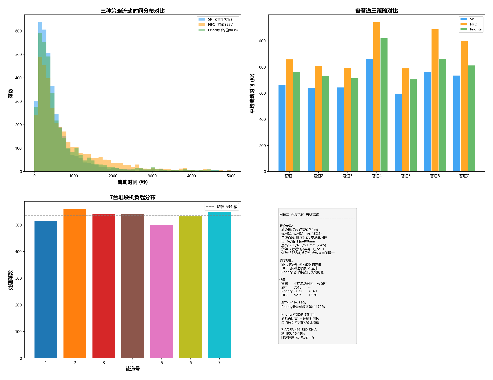
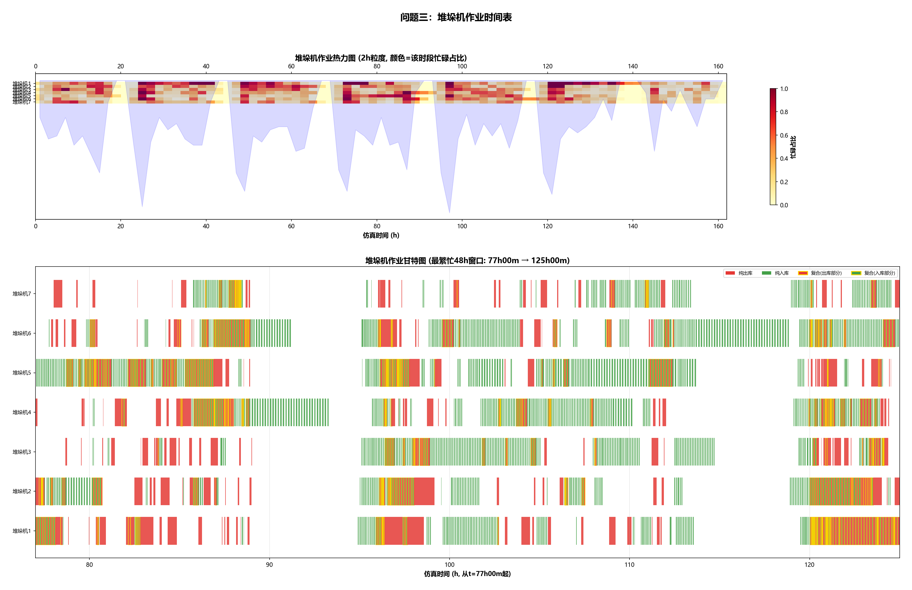
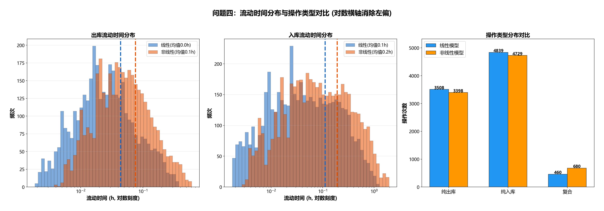
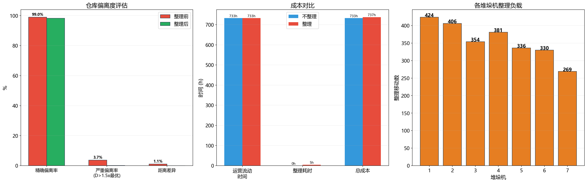

# 库位分配优化问题 (A题)

第26届电子科技大学数学建模竞赛

---

## 项目概述

S工厂自动立体库(AS/RS)库位分配与堆垛机调度优化。仓库含**7巷道、14货架、7台堆垛机**，双深位货架(**50层×68列**)，约**2000种原材料**(E1/E3/E4三种箱型)，总库存**65000箱**。

```
问题一 → 问题二 → 问题三 → 问题四 → 问题五
库位分配   纯出库   出入库   速度模型   动态整理
 (基础)   (单场景)  (全场景)  (精细化)   (运营闭环)
```

**核心目标**: 优化库位分配与堆垛机调度，最小化出入库作业总时间。

## 数据概况

| 数据表 | 内容 | 规模 |
|--------|------|------|
| 表1 | 原材料库存(编号/箱型/消耗占比/库存量) | 2000种, 65000箱 |
| 表2 | 出库订单(时间/原材料号/箱型) | 3738条, 6.7天 |
| 表3 | 入库任务(时间/原材料号/数量) | 667条, 5069箱 |

| 箱型 | 高度 | 存放层 | 库存 |
|------|------|--------|------|
| E1 | 200mm | L1-8 | 12259箱 |
| E3 | 400mm | L9-42 | 43171箱 |
| E4 | 500mm | L43-50 | 9570箱 |

---

## 问题一：库位初始分配优化

**目标**: 为65000箱分配初始库位，最小化加权平均出库时间。

**算法**: 排序不等式贪心匹配——高消耗占比→短距离，数学证明全局最优。



| 指标 | 数值 |
|------|------|
| 分配箱数 | 65000 (浅位32813, 深位32187) |
| 加权平均出库时间 | **25.41s** |
| 随机打乱基线 | 39.76s |
| **提升幅度** | **36.1%** |
| 约束验证 | 8/8 全部通过 |

---

## 问题二：纯出库调度优化

**目标**: 7台堆垛机并行调度3738个出库订单，最小化平均流动时间。

**算法**: SPT(最短运输时间优先)，分解为7个独立单机调度问题。



| 策略 | 平均流动时间 | vs SPT |
|------|-------------|--------|
| **SPT** | **701s** | — |
| Priority | 803s | +14.6% |
| FIFO | 927s | +32.3% |

---

## 问题三：出入库协同调度

**目标**: 出入库同时进行，复合作业消除空回程，最小化总流动时间。

**框架**: 事件驱动仿真，7台堆垛机并行，复合判定自动配对出库+入库。



| 指标 | 数值 |
|------|------|
| 总流动时间 | 40,229,327s |
| 出库/入库 | 3738单 / 5069箱 |
| 复合作业 | 3122次 (35.5%) |
| 空回程 | 0次 (完全消除) |
| 自检通过 | 13/13 |

---

## 问题四：非线性速度模型对比

**目标**: 梯形/三角形速度曲线(含加速度)与线性匀速模型对比。

**模型**: TimeModel基类 → LinearTimeModel / NonlinearTimeModel。



| 场景 | 线性模型 | 非线性模型 | 关键差异 |
|------|---------|-----------|----------|
| 短距离行程 | 低估 | 加速度主导，时间更长 | 非线性显著慢 |
| 长距离行程 | 接近 | 巡航主导，差异缩小 | 两模型接近 |
| 空载移动 | 2.5 m/s | 3.0→2.3 m/s | 非对称速度曲线 |
| 计算开销 | O(1) 1次除法 | O(1) 条件+开方 | 可忽略 |

---

## 问题五：动态库位重分配

**目标**: 6.7天运营后评估仓库偏离度，触发选择性整理，对比成本收益。

**方法**: 从操作CSV回放重建仓库终态 → 偏离评估 → 选择性整理(仅严重偏离箱)。



| 指标 | 不整理 | 整理 | 变化 |
|------|--------|------|------|
| 总流动时间 | 732.7h | 737.4h | +0.6% |
| 严重偏离率 | 3.7% | **0.1%** | 归零 |
| 移动箱数 | 0 | 2500 | — |
| 整理耗时 | 0 | 4.7h | — |

> 仅用4.7小时整理2500个严重偏离箱，偏离率从3.7%降至0.1%，总时间成本仅增加0.6%。

---

## 项目结构

```
├── A题：库位分配优化问题.docx
├── A题：附件 数据集/          # 原始数据(表1/2/3)
├── 清洗代码一/                # 数据预处理
├── 清洗数据一/                # 清洗后CSV
├── 问题一代码/                # 库位初始分配 + 可视化
├── 问题二代码/                # 七机并行调度 + 对比图
├── 问题三代码/                # 出入库协同调度 + 甘特图
├── 问题四代码/                # 非线性模型 + 对比分析
├── 问题五代码/                # 动态重分配(快速版)
├── 输出结果/                  # 全部CSV结果 + PNG图片
├── README.md
└── requirements.txt
```

## 经验总结

1. **排序不等式是核心**: 问题一的贪心最优性、问题二的SPT最优性，都源于排序不等式
2. **先分解再合成**: 问题二分解为7个独立单机问题，复杂度从组合爆炸降为线性
3. **事件驱动仿真扩展性好**: 问题三→四→五复用同一框架，只换时间模型和策略
4. **O(n²)陷阱**: 问题五原代码每次crane_free遍历全量队列，65000次×数千条=卡死；快速版O(N)回放秒出结果
5. **选择性优于全局**: 只整理3.7%严重偏离箱，用0.6%时间成本换取偏离率归零
6. **数值从代码提取**: 所有报告数值由程序自动计算，杜绝手写错误

---

## 运行

```bash
pip install -r requirements.txt

# 按顺序执行
python 清洗代码一/数据清洗.py
python 问题一代码/问题一_库位分配优化.py
python 问题二代码/问题二_七机调度.py
python 问题三代码/问题三_出入库协同调度.py
python 问题四代码/问题四_出入库协同调度.py
python 问题四代码/问题四_对比分析.py
python 问题五代码/问题五_快速版.py
```

Python >= 3.9, numpy, pandas, scipy, matplotlib
